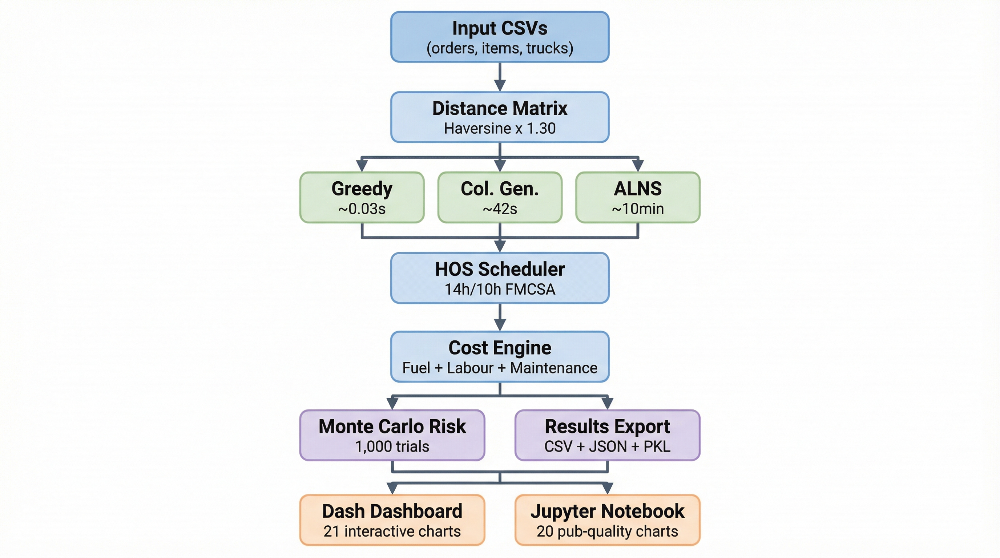

<p align="center">
  
</p>


<h1 align="center">Fleet Route Optimisation Engine</h1>

<p align="center">
  <strong>Vehicle Routing Modeling with HOS-Compliant Scheduling, Monte Carlo Risk Analysis, and Azure Cloud Deployment</strong>
</p>

<p align="center">
  Pedro Paulo da Cruz Mendes (petter.mendes@outlook.com) -- AI / Cloud Engineer Candidate<br>
  February 2026
</p>

<p align="center">
  <a href="#problem-statement">Problem</a> --
  <a href="#solution-architecture">Architecture</a> --
  <a href="#solver-portfolio">Solvers</a> --
  <a href="#key-results">Results</a> --
  <a href="#dashboard">Dashboard</a> --
  <a href="#azure-deployment">Azure</a> --
  <a href="#how-to-run">Run</a> --
  <a href="#limitations-and-next-steps">Next Steps</a>
</p>

---

## Dashboard (Dash-Plotly) Preview:

> Non-operational

---

## Problem Statement

The company operates **15 trucks** (FHWA Class 5 through 8) from a single depot in **Cincinnati, OH**, delivering **300 order lines** across **58 destinations** spanning North America -- from Toronto to Key West, from Portland to Las Vegas.

The challenge is a variant of the **Capacitated Vehicle Routing Problem (CVRP)**, one of the most studied problems in combinatorial optimisation (Toth & Vigo, 2014). The objective:

$$\min \sum_{k \in K} \sum_{(i,j) \in A} c_{ij} \cdot x_{ijk}$$

subject to:

- Every order delivered exactly once
- No truck exceeds its payload capacity
- Maximum 8 delivery stops per route
- FMCSA Hours-of-Service compliance (14h work / 10h mandatory rest)

**Why is this hard?** The CVRPTW is NP-hard.... With 300 orders and 15 trucks, the feasible solution space exceeds $10^{353}$ -- a number that dwarfs the estimated atoms in the observable universe ($\approx 10^{80}$). No exact algorithm solves this in practical time.

### Input Data

| Dataset | Records | Description |
|:---|:---:|:---|
| `item_info.csv` | 29 products | Weight per unit, origin (Cincinnati) |
| `orders.csv` | 300 lines | Company, item, quantity, destination city |
| `trucks.csv` | 15 vehicles | Driver, vehicle class, capacity, hourly rate |

### Fleet Composition

| Class | Length (m) | Capacity (kg) | Fuel Economy (MPG) | Count |
|:---|:---:|:---:|:---:|:---:|
| Class 8 | 16.06 | 10,000 | 5.5 | 5 |
| Class 7 | 14.82 | 7,500 | 6.0 | 4 |
| Class 6 | 13.98 | 6,000 | 6.5 | 3 |
| Class 5 | 11.57 | 4,000 | 7.5 | 3 |

---

## Solution Architecture

<p align="center">
  
</p>

---

## Solver Portfolio

Four solvers of increasing sophistication, each addressing a different speed-quality trade-off.

### Solver 1 -- Greedy Constructive Heuristic

**Runtime:** ~0.03s | **Approach:** Four-phase pipeline

1. **First-Fit Decreasing Bin Packing**-- groups orders by destination, packs heaviest first.
2. **Clarke-Wright Savings Merge**. -- merges routes when the round-trip savings exceed the direct-link cost: $s_{ij} = d(W, \text{last}_i) + d(W, \text{first}_j) - d(\text{last}_i, \text{first}_j)$.
3. **TSP Optimisation** -- nearest-neighbour construction + 2-opt local search.
4. **Load-Balanced Truck Assignment** -- heaviest routes assigned first, balanced across drivers.

Best used as a real-time fallback for intra-day re-routing when a truck breaks down or a rush order arrives.

### Solver 2 -- Column Generation

**Runtime:** ~42s | **Approach:** LP relaxation + pricing subproblem.

Solves the set-covering master LP over a pool of feasible routes, then generates new routes via dual-price-guided pricing. The LP bound is the tightest lower bound achievable without full integer programming. Integer rounding via greedy set cover with $O(\ln n)$ approximation guarantee.

The connection to Lagrangian relaxation is not coincidental -- CG automatically solves the Lagrangian dual. Each iteration implicitly updates the multipliers toward optimality.

### Solver 3 -- Adaptive Large Neighbourhood Search (ALNS)

**Runtime:** ~10min | **Approach:** Destroy-repair metaheuristic.

The production solver. Iteratively destroys 10-35% of the current solution and rebuilds it using adaptive operator selection.

**Simulated annealing acceptance:**

$$P(\text{accept}) = \begin{cases} 1 & \text{if } \Delta \leq 0\\[4pt] e^{-\Delta / T} & \text{if } \Delta > 0 \end{cases}$$

with $T_0 = 500$, $\alpha = 0.9997$, over 6,000 iterations.

**Operator adaptation** (roulette-wheel selection, updated every 100 iterations):

$$w \leftarrow \max\!\left(0.05,\; w \cdot (1 - \rho) + \rho \cdot \frac{\text{score}}{\text{uses}}\right)$$

| Destroy Operators | Repair Operators |
|:---|:---|
| Random removal | Greedy insertion |
| Worst removal (marginal cost) | Regret-2 insertion |
| Shaw removal (relatedness) | Noisy greedy (Gaussian perturbation) |
| Route removal (worst distance/weight) | |

### Solver 4 -- Multi-Objective Pareto Optimiser

**Runtime:** Variable | **Approach:** Non-dominated sorting across probing runs

Optimises three objectives simultaneously:

| Objective | Formula | Goal |
|:---|:---|:---|
| Total cost | $f_1 = \sum D_r$ | Minimise |
| Makespan | $f_2 = \max_r T_r$ | Minimise |
| Utilisation balance | $f_3 = \text{stdev}(u_1, \ldots, u_n)$ | Minimise |

Returns the Pareto front for strategic fleet composition decisions (for example, whether to invest in more Class 6 trucks).

---

## Key Results

### Fleet Performance (ALNS Solution)

| KPI | Value |
|:---|---:|
| Total fleet cost | $116,396 |
| Routes dispatched | 33 |
| Orders fulfilled | 300 / 300 (100%) |
| Total distance | 79,166 mi |
| CO2 emitted | 147 tonnes |
| Cost per mile | $1.47 |
| Truck utilisation | 96.1% |

### Cost Structure (ALNS)

| Component | Share | Key Driver |
|:---|:---:|:---|
| Fuel | 46% | Route length -- every 100 mi saved = ~$56 |
| Labour | 43% | HOS rest breaks -- each avoided 10h rest = ~$250 |
| Maintenance | 10% | Mileage-based at $0.15/mi |

### Solver Comparison

| Solver | Fleet Cost | Routes | Total Distance | Runtime | Robustness (MC) |
|:---|---:|:---:|:---:|:---:|:---:|
| Greedy | $126,854 | 33 | 87,391 mi | ~0.03s | 96% |
| Column Generation | $129,631 | 47 | 89,307 mi | ~42s | 96% |
| **ALNS** | **$116,396** | **33** | **79,166 mi** | **~10min** | **96%** |

### Monte Carlo Risk Profile (ALNS, 1,000 trials)

| Metric | Value |
|:---|---:|
| Deterministic cost | $116,396 |
| P50 (median) | $118,271 |
| P95 (worst case) | $126,940 |
| Robustness score | 96% |

Fuel price volatility is the dominant risk factor. Truck breakdowns have minimal impact due to fleet redundancy.

### Carbon Footprint

$$\text{CO}_2^{(r)} = \frac{d_r}{\eta_r} \times 10.18 \;\text{kg/gal}$$

147 tonnes total (ALNS). Distance-to-emissions is nearly linear ($R^2 > 0.99$), making route length the single best predictor of carbon impact. ALNS cuts 15 tonnes of CO2 vs Greedy (162t) by eliminating 8,225 miles of redundant driving.

---

## Distance and Cost Models

### Haversine Distance with Road Correction

$$d_{\text{road}}(i,j) = 1.30 \times 2R \arcsin\!\left(\sqrt{\sin^2\!\left(\frac{\phi_j - \phi_i}{2}\right) + \cos\phi_i \cos\phi_j \sin^2\!\left(\frac{\lambda_j - \lambda_i}{2}\right)}\right)$$

where $R = 3{,}959$ mi, $\kappa = 1.30$ road factor.

### Three-Component Cost

$$C_{\text{route}} = \underbrace{\frac{D}{\eta} \times \$3.75}_{\text{fuel}} + \underbrace{t_{\text{work}} \times r_{\text{driver}}}_{\text{labour}} + \underbrace{D \times \$0.15}_{\text{maintenance}}$$

where $t_{\text{work}} = t_{\text{drive}} + t_{\text{load}} + t_{\text{stops}}$ at $v_{\text{avg}} = 55$ mph.

### HOS Scheduling (FMCSA)

| Rule | Constraint | Effect |
|:---|:---|:---|
| 14-hour work window | Max 14 consecutive hours on duty | Caps route duration per shift |
| 10-hour mandatory rest | Must rest 10h before next shift | Adds idle time that inflates labour cost |
| 30-min loading | Warehouse preparation per departure | Fixed overhead per route |
| 35-min stop overhead | Unload + paperwork per delivery | Scales with number of stops |

---

## Dashboard

21 interactive charts across six analytical sections, styled with corporate palette (navy / gold / green / crimson on cream).

### Per-Solver Analytics

| Chart | Type | What It Shows |
|:---|:---|:---|
| Route Network Map | Scattergeo | Geographic route lines with depot marker |
| Cost Waterfall | Waterfall | Fuel to labour to maintenance to total |
| Cost by Route | Stacked bar | Cost composition per route |
| Fleet Utilisation | Horizontal bar | Capacity % vs 90% target |
| Distance vs Weight | Bubble scatter | Bubble size = cost |
| Driver Workload Radar | Radar | Routes / distance / weight / cost |
| Cost Treemap | Treemap | Fleet to category to route hierarchy |
| Dispatch Timeline (Gantt) | Bar | HOS-compliant schedule per driver |
| Driver-Distance Heatmap | Heatmap | Miles by driver x week |
| Cost Sankey | Sankey | Money flow: routes to cost components |
| Efficiency Frontier | Scatter + hull | Cost/kg vs dist/stop |
| Delivery Cadence | Step chart | Cumulative deliveries over time |
| CO2 by Route | Horizontal bar | Per-route emissions vs average |
| Emissions Waterfall | Waterfall | CO2 by truck class |
| MC Cost Distribution | Histogram | 1,000-trial histogram with P5/P95 |
| Sensitivity Tornado | Tornado bar | Factor impact on total cost |
| Robustness Gauge | Gauge | 0-100% robustness score |

### Cross-Solver Comparison (2+ strategies loaded)

| Chart | Type | What It Shows |
|:---|:---|:---|
| Cost Breakdown | Grouped bar | Fuel / labour / maintenance per strategy |
| Efficiency Radar | Radar | 5-axis normalised comparison |
| Routes and Distance | Dual-axis | Route count (bar) + total miles (line) |
| Risk Distribution | Violin + box | MC cost distributions per solver |
| Cost per Mile | Box + strip | Route-level $/mi spread |
| Risk Metrics Table | Table | P50, P95, spread, robustness |

### Jupyter Notebook

`fleet_analytics.ipynb` contains 22 publication-quality charts with full analytical narrative, mathematical formulations, and strategic commentary built from the same CSV exports and solver cache.

---

## Azure Deployment

The dashboard is deployed as a production web application on **Azure App Service**.

### Architecture

| Component | Azure Service | Purpose |
|:---|:---|:---|
| Dashboard | Azure App Service (B1 Linux) | Serves the Dash/Plotly app with Gunicorn |
| Source | Azure DevOps / GitHub | Git-based deployment to azure/master |
| Runtime | Python 3.11 on Linux | Gunicorn WSGI with custom startup script |
| DNS | Azure-managed | `*.azurewebsites.net` with TLS |

### Deployment Pipeline

```
Local development
    |
    v
git push azure master
    |
    v
Azure App Service (Oryx build)
    |-- pip install -r requirements.txt
    |-- entrypoint.sh (Gunicorn launcher)
    |
    v
https://fleet-dashboard-grg7cjbtevh6ckgy.eastus2-01.azurewebsites.net/
```

### Production-Scale Architecture (Proposed)

For enterprise deployment beyond the prototype:

| Component | Azure Service | Purpose |
|:---|:---|:---|
| Solver engine | Azure Container Apps | Serverless ALNS execution, auto-scale for batch windows |
| Data pipeline | Azure Data Factory | Ingest orders/truck data from ERP systems |
| Storage | Azure Blob + SQL DB | Route results, historical analytics, audit trail |
| ML enrichment | Azure Machine Learning | Demand forecasting, travel time prediction |
| Monitoring | Azure Monitor + Log Analytics | Solver SLA tracking, anomaly detection |
| Digital twin | Azure Digital Twins | What-if fleet composition analysis |

---

## How to Run

### Prerequisites

```bash
python -m venv .venv
.venv\Scripts\activate                    # Windows
pip install -r optimization/requirements.txt
```

### Solve and Launch Dashboard

```bash
cd optimization
python main.py --solver greedy --dashboard    # Fast: ~0.03s
python main.py --solver alns --dashboard      # Production: ~10 min
python main.py --solver all --dashboard       # All solvers: ~11 min
```

### Instant Dashboard Reload (Skip Solvers)

```bash
python main.py --dashboard-only
# Reloads from results/solver_cache.pkl (< 2s)
```

### Monte Carlo Risk Simulation

```bash
python main.py --solver greedy --monte-carlo --dashboard
python main.py --solver all --monte-carlo --dashboard
```

---

## Limitations and Next Steps

### Current Limitations

| Limitation | Impact | Mitigation |
|:---|:---|:---|
| Haversine x 1.30 distance | 5-10% distance error vs actual roads | Integrate OSRM or Google Distance Matrix API |
| Single depot (Cincinnati) | Cannot explore multi-hub strategies | Add western hub (Denver/Dallas) for 15-25% savings |
| Constant 55 mph speed | Ignores terrain, urban congestion, weather | Speed profiles per road segment from telematics |
| Deterministic demand | No dynamic/stochastic order arrivals | Stochastic VRP with rolling-horizon re-optimisation |
| Simplified HOS (14h/10h only) | Missing 11h drive limit, 30-min break, weekly caps | Full FMCSA rule engine |
| No customer time windows | Delivery accepted at any time | CVRPTW formulation with penalty functions |
| No toll-road modelling | Missing $50-200/route on eastern turnpikes | Toll-aware shortest path (OSRM + toll plugins) |

### Near-Term Improvements (< 3-4 days)

| Improvement | Expected Impact | Effort |
|:---|:---|:---|
| Real road distances (OSRM API) | 5-10% cost accuracy gain | 2-3 days |
| Customer time windows | Better SLA compliance | 1 week |
| Speed profiles by road type | 3-5% routing improvement | 3-4 days |
| Toll-aware routing | $2,000-5,000 annual savings | 2-3 days |

### External Data Integration Roadmap

| Data Source | Provider | What It Enables |
|:---|:---|:---|
| Real-time diesel prices | EIA Weekly Petroleum Status Report API | Dynamic fuel cost in Monte Carlo + hedging triggers |
| Road network distances | OSRM / Google Maps Distance Matrix | Replace Haversine with actual driving distances and times |
| Historical traffic patterns | HERE / TomTom Traffic APIs | Time-of-day speed profiles for scheduling accuracy |
| Weather disruption forecasts | NOAA / OpenWeatherMap API | Proactive re-routing around storms and road closures |
| US highway detailed routes | FHWA HPMS (Highway Performance Monitoring System) | Truck-legal route validation, weight restriction compliance |
| Freight rate benchmarks | DAT Freight Analytics | Market-rate validation for cost model calibration |
| Vehicle telematics | Samsara / Geotab fleet APIs | Real fuel economy, idle time, driver behaviour scoring |

---

## Project Structure

```
Exercise/
|-- video_adjusted.mp4                  # Dashboard demo recording
|-- item_info.csv                       # 29 products
|-- orders.csv                          # 300 order lines
|-- trucks.csv                          # 15 vehicles
|-- app.py                              # Azure WSGI entry point
|-- wsgi.py                             # Gunicorn config
|-- entrypoint.sh                       # Azure startup script
|-- requirements.txt                    # Python dependencies
|
+-- optimization/
    |-- main.py                         # CLI entry point and pipeline
    |-- README_AUX.md                  # Technical deep-dive documentation
    |
    +-- src/
    |   |-- config.py                   # Constants, city coords, hyperparameters
    |   |-- models.py                   # Domain objects (Truck, Order, Route, Solution)
    |   |-- data_loader.py              # CSV to domain objects
    |   |-- cost_engine.py              # Fuel + labour + maintenance + CO2
    |   |-- distance.py                 # Haversine, distance matrix
    |   |-- scheduler.py               # HOS-compliant timeline builder
    |   |-- reporting.py               # CSV + console reporting
    |   |-- monte_carlo.py             # 1,000-trial risk simulation
    |   +-- solvers/
    |       |-- base.py                # Abstract solver interface
    |       |-- greedy.py              # Four-phase constructive heuristic
    |       |-- alns.py                # Adaptive Large Neighbourhood Search
    |       |-- column_gen.py          # Column Generation (LP + pricing)
    |       +-- pareto.py              # Multi-objective Pareto optimiser
    |
    +-- dashboard/
    |   |-- app.py                     # Dash application factory
    |   |-- layouts.py                # Component tree (HTML structure)
    |   |-- figures.py                # 21 Plotly figure factories
    |   |-- callbacks.py              # Interactive callbacks (18 outputs)
    |   +-- assets/
    |       +-- style.css             # Corporate theme
    |
    +-- fleet_analytics.ipynb          # 22-chart analytical notebook
    |
    +-- results/                       # Auto-generated outputs
        |-- route_details.csv
        |-- order_assignments.csv
        |-- fleet_summary.csv
        |-- dispatch_timeline.csv
        |-- solution_metadata.json
        +-- solver_cache.pkl           # Cached results for --dashboard-only
```

---

<p align="center">
  <strong>The Company</strong> -- AI / Cloud Architecture<br>
  Pedro Paulo da Cruz Mendes -- Sao Paulo, SP, Brazil | Illinois, US<br>
  February 2026
</p>
